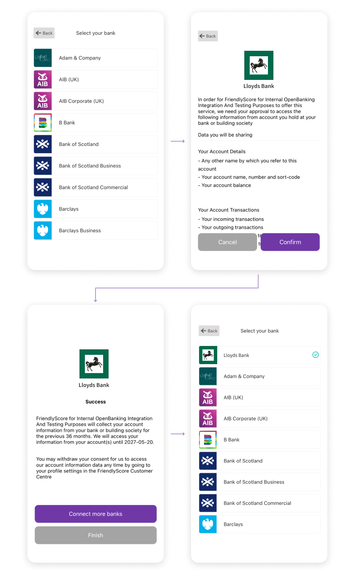

# Overview
  <p align="center">
    
  </p>

## Introduction

Here you can find instructions on how to integrate and use FriendlyScore Connect for Android.

To get started quickly with FriendlyScore Connect for Android, clone the GitHub repository and run the example. You will need to [sign-up](https://friendlyscore.com/getting-started) for the free API keys through our Developer Console.

## Requirements

  - Install or update Android Studio to version 3.2 or greater
  - We support Android 5.0 and greater
  - [FriendlyScore Client Id](https://friendlyscore.com/company/keys)


## QuickStart
  The easiest way to get started is to clone the repository https://github.com/FriendlyScore/FriendlyScore-Connect-Android-Example. Please follow the instructions below to provide the necessary configuration and to understand the flow.

## **Getting Set up**

#### Add the following values to your Project Level build.gradle file
  In your project-level Gradle file (build.gradle), add rules to include the Android Gradle plugin. The version should be equal to or greater than `3.2.1`

    buildscript {
        ...
        dependencies {
            classpath 'com.android.tools.build:gradle:3.2.1'
        }
    }  
### **FriendlyScore Configuration**
   
#### **Add FriendlyScore Android Framework configuration to your app**
   In the project-level gradle.properties file please add the following configuration values

    //This value must be specified
    CLIENT_ID=client_id
    //You must specify the value the SDK will use for android:scheme to redirect back to your app. https://developer.android.com/training/app-links/deep-linking
    APP_REDIRECT_SCHEME=Please Provide this value.


#### **Add the following values to your App Level build.gradle file(In the demo app/build.gradle)**
  Now we must read the configuration to create the string resources that will be used by the FriendlyScore Android SDK.

    android {
      ...
      compileOptions {
      sourceCompatibility 1.8
      targetCompatibility 1.8
      }
 
      defaultConfig {
        //Must Provide these Values
        resValue "string", "fs_client_id", (project.findProperty("CLIENT_ID") ?: "NO_CLIENT_ID")
        resValue "string", "fs_app_redirect_scheme", (project.findProperty("APP_REDIRECT_SCHEME") ?: "NO_APP_REDIRECT_SCHEME_PROVIDED")
      }
    }

#### **Add FriendlyScore Android Framework to your app**
  In your module or app-level gradle file(In the demo `app/build.gradle`) please add the FriendlyScore Android SDK library listed below to your list of dependencies

    dependencies {
       ...
       implementation 'com.github.friendlyscore.fs-android-sdk:friendlyscore-connect:1.0.21'
    }

## **Integrating with FriendlyScore**
  
#### **Start FriendlyScore**
  In order to start FriendlyScore for your user you must have the `userReference` for that user. The `userReference` uniquely identifies the user in your systems. This `userReference` can then be used to access information from the FriendlyScore [api](https://developers.friendlyscore.com).

    public String userReference = "YOUR_USER_REFERENCE";

  In order to listen when the user returns from the FriendlyScoreView in your `onActivityResult`, you must provide the `requestcode` that you will be using

    public final int REQUEST_CODE_FRIENDLY_SCORE = 11;

  You can select which environment you want to use the FriendlyScore SDK

  | Environment |   Description |
  | :----       | :--             |
  | sandbox     | Use this environment to test your integration |
  | production  | Production API environment |

These environments are listed in the SDK as below

    Environments.SANDBOX
    Environments.PRODUCTION

  Define the environment variable

    public Environments environment = Environments.PRODUCTION;

### Customization

#### Theme
FriendlyScoreConnect can be presented with light (default) or dark theme, with are predefined list of colors and icons.

To use custom colors for the categories, you must override the color keys in your application.

You can also create a custom theme and use that value when you trigger the `ConnectUI`.

Custom theme examples is included in the [styles.xml](https://github.com/FriendlyScore/FriendlyScore-Connect-Android-Example/blob/master/app/src/main/res/values/styles.xml). The color keys and descriptions are in the `Colors`section.

You must extend the Default theme while creating the custom theme


    <style name="CustomConnectDarkTheme" parent="ConnectDarkTheme">

    </style>


The existing themes for `Connect` are declared below

```
    /**
        Connect Light Theme - R.style.ConnectLightTheme
        Connect Dark Theme - R.style.ConnectDarkTheme

    */
    public int connectUITheme = R.style.ConnectLightTheme

```

#### Other
    /**
        Show Only Icon for Back Button
    */

    public Boolean showOnlyIconBackButton = false


    /**
       Text Label for Back Button

    */
    public String backButtonLabel = "Back"

    /**
            Force App to start with Browser flow (Default set to browser flow)

    */
    public Boolean forceBrowserFlow = false


Initiate FriendlyScoreView using the above values

    public void startFriendlyScore() {
                FriendlyScoreView.Companion.startFriendlyScoreView(this, getString(R.string.fs_client_id), userReference, REQUEST_CODE_FRIENDLY_SCORE, environment, connectUITheme, showOnlyIconBackButton, backButtonLabel, forceBrowserFlow);
    }


### Colors

##### Colors across views
| Color Key                                     |  Description                                                                                          |
|-----------------------------------            |  ---------------------------------------------------------------------------------------------|
| connectBackgroundColor                        |  Background color for all views in the SDK                                                    |
| connectDividerColor                           |  Divider color for all view in the SDK                                                        |
| connectCancelButtonColor                      |  Background color for Cancel, Disconnect Buttons                                              |
| connectNextButtonColor                        |  Background color for Next, Confirm Button                                                    |
| connectButtonTextColor                        |  Text color for Buttons                                                                       |
| connectBankDetailMarkerColor                  |  Color for the marker on the detail view for a connected bank                                |
| connectNavigationButtonBackgroundColor        |  Background color for navigation button in the toolbar                                        |
| connectNavigationBackButtonItems              |  Color of the back button  for the navigation button                                          |
| connectToolbarIconsColor                      |  Color for the search icon in the toolbar                                                     |
| connectToolbarTextColor                       |  Color for the search field cursor                                                            |
| connectToolbarSearchTextColor                 |  Color for the search text query                                                              |
| connectToolbarSearchCursorColor               |  Color for the search field cursor                                                            |

##### Colors for View: List of Banks
| Color Key                                     |  Description                                                                                  |
|-----------------------------------            |  ---------------------------------------------------------------------------------------------|
| connectBankItemBackgroundColor                |  Background color for bank item in the list of banks                                          |
| connectBankItemTextColor                      |  Text color for bank item in the list of banks                                                |
| connectBankItemDisabledTextColor              |  Text color for bank item if its disabled or not available in the list of banks               |
| connectBankItemBorderColor                    |  Border color for the bank item in the list of banks                                          |
| connectedBankItemConnectedStatusColor         |  Color of the connected status icon for the bank item in the list of banks                    |
| connectBankItemUnavailableStatusColor         |  Color of the unavailable status icon for the bank item in the list of banks                  |

##### Colors for View: Filter
| Color Key                                     |  Description                                                                                  |
|-----------------------------------            |  ---------------------------------------------------------------------------------------------|
| connectFilterHeaderDisabledColor              |  Color for the filter header background color                                                 |
| connectFilterPageTitleColor                   |  Color for the filter header text color                                                       |
| connectFilterPageSubTitleColor                |  Color for the filter item text color                                                         |

## **Handle Response from FriendlyScore**

If you need to know when the user returns from the FriendlyScore Flow add this to your Activity or Fragment
The `onActivityResult` is called when the SDK is closed. The `data` object returned `onActivityResult` contains various states that are available depending on the product configuration on the server. The `data` object can contain both `errors` & `events`


        
    @Override
    protected void onActivityResult(int requestCode, int resultCode, @Nullable Intent data) {
      super.onActivityResult(requestCode, resultCode, data);
      if(requestCode == REQUEST_CODE_FRIENDLY_SCORE){
            //Present if there was error in creating an access token for the supplied userReference.
            if(data!=null && data.hasExtra("userReferenceAuthError")){
                //Do Something
            }
            //Present if there was service denied.
            if(data!=null && data.hasExtra("serviceDenied")){
                if(data.hasExtra("serviceDeniedMessage")){
                    String errorDescription = data.getStringExtra("serviceDeniedMessage");
                }
            }
            //Present if the configuration on the server is incomplete.
            if(data!=null && data.hasExtra("incompleteConfiguration")){
                if(data.hasExtra("incompleteConfigurationMessage")){
                    String errorDescription = data.getStringExtra("incompleteConfigurationMessage");
                }
            }
            //Present if there was error in obtaining configuration from server
            if(data!=null && data.hasExtra("serverError")){
                //Try again later
            }
            //Present if the user completed the entire flow for Forecast
            if(data!=null && data.hasExtra("userCompletedFlow")){
                //Success
            }
            // //Present if the user closed the flow
            if(data!=null && data.hasExtra("userClosedView")){
                //The user closed the process
            }
        }
    }

## Error Definition
| Error                    | Definitions  | 
| -------------             | -------------|
| userReferenceAuthError   | Present if there was an authentication error for the supplied `userReference`.
| serviceDenied             | Present if service was denied. Please check the description for more information.
| incompleteConfiguration             | Present if the configuration on the server is incomplete. Please check the description for more information.
| serverError               | Present if there was a critical error on the server.      

## Response State Definition
| State                    | Definitions  | 
| -------------             | -------------|
| userClosedView            | Present if the user Closed the FriendlyScore Flow.      
| userCompletedFlow         | Present if the user Completed the FriendlyScore flow.

## Next Steps

### Access to Production Environment

You can continue to integrate FriendlyScore Connect in your app in our sandbox environment. Once you have completed testing, you can access the production environment in the developer console.

### Support 

Find commonly asked questions and answers in our [F.A.Q](https://friendlyscore.com/developers/faq). You can also contact us via email at [developers@friendlyscore.com](mailto:developers@friendlyscore.com) or speak directly with us on LiveChat.

You can find all the code for FriendlyScore Connect for Web component, iOS and Android on our [GitHub](https://github.com/FriendlyScore).
